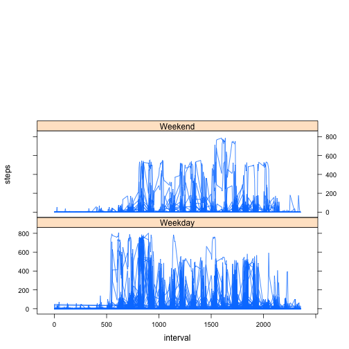

# Reproducible Research: Peer Assessment 1


## Loading and preprocessing the data


```r
d  <- read.csv("activity.csv")
```

## Aggregate the data into required groups

```r
d.byDate <- aggregate(steps ~ date, data = d, FUN=sum)
d.byInterval <- aggregate(steps ~ interval, data = d, FUN=sum)
```

## What is mean total number of steps taken per day?


```r
m <- mean(d.byDate$steps, na.rm=T)
n <- median(d.byDate$steps, na.rm=T)
```


```r
hist(d.byDate$steps, xlab="Total Steps per Day",main="Histogram of Total Steps per Day")
```

 

The mean is 1.0766 &times; 10<sup>4</sup> and the median is 10765.

## What is the average daily activity pattern?

```r
plot(d.byInterval$interval, d.byInterval$steps, type="l", xlab="5 Min Interval", ylab="Average number of Steps for Interval")
```

 

```r
maxRow <- which.max(d.byInterval[, 2])
maxInterval <- d.byInterval[maxRow, 1]
```

The  interval that, on average, has the maximum amount of steps is #835
## Imputing missing values

### First we count the number of NA's

```r
numNA <- sum(is.na(d))
```

### Then we fill them in with 0 (hey, they said not sophisticated:) 


```r
d2 <- rbind(d) ## make a copy of d
d2[is.na(d2$steps), "steps"]  <- 0
```


```r
d2.byDate <- aggregate(steps ~ date, data = d2, FUN=sum)
```


```r
hist(d2.byDate$steps, xlab="Total Steps per Day",main="Histogram of Total Steps per Day", breaks=20)
```

 


```r
m2 <- mean(d2.byDate$steps)
n2 <- median(d2.byDate$steps)
```

The new mean is 9354.2295 and the new median is 1.0395 &times; 10<sup>4</sup>, which are different by -1411.9592 and -370 steps  than previous.  Clearly, assigning values to NA data, in this case 0, skews the results smaller slightly.  


## Are there differences in activity patterns between weekdays and weekends?

Here we convert the date into POSIX format and then substitute "weekday" or "weekend"
This is a dirty, dirty, low down hack.  I hope no children are watching.


```r
d2$dow <- weekdays(strptime(d2$date, "%Y-%m-%d")) ## get date into POSIX
d2$dow <- gsub("Monday|Tuesday|Wednesday|Thursday|Friday", "Weekday", d2$dow) ## I'm not proud of this
d2$dow <- gsub("Saturday|Sunday", "Weekend", d2$dow) ## Don't judge
```

Now we get our plot ready


```r
library(lattice)
mypanel = function(x,y,...){
  panel.xyplot(x,y,...)
  }
xyplot(steps ~ interval | dow,data=d2, type="l", layout=(c(1,3)))
```

 
